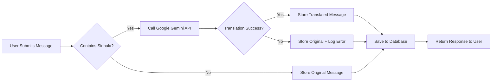

<div align="center">

# 🎓 Quality Education Backend

### A Web-Based Peer Learning and Tutoring Platform for School Students


</div>

---

## 📌 Overview

**Quality Education** is a web-based peer-learning and tutoring platform designed to connect school students with qualified tutors in an efficient and scalable manner.

The platform enables students to request academic help, **automatically translates Sinhala messages into English** using the **Google Gemini API**, and allows tutors to respond effectively.

This system promotes **accessible, structured, and collaborative digital education**.

---

## 🚀 Key Features

### 🔐 Authentication & Authorization

- ✅ **Role-based access control (RBAC)**
- ✅ Secure login & registration
- ✅ JWT-based authentication
- ✅ Three user roles:
  - 👨‍🎓 **Student (User)**
  - 👨‍🏫 **Tutor**
  - 🛡️ **Admin**

### 💬 Help Request Management (Full CRUD)

#### Students can:
- ✍️ Create help requests
- 👀 View submitted requests
- ✏️ Update messages (with translation support)
- 🗑️ Delete requests

#### Tutors & Admin can:
- 📋 View all help requests
- 💡 Respond to student queries

### 🌍 Sinhala to English Translation

- 🔍 **Detects Sinhala Unicode range** (0D80–0DFF)
- 🤖 **Automatically translates** to English using Google Gemini API
- 💾 Stores translated message in database
- ⚡ Avoids API call if message is already English (optimization)
- 🔄 **Translation on both create and update** operations

---

## 🏗️ System Architecture

```
┌─────────────────────────────────────────────────┐
│           Client (Student/Tutor/Admin)          │
└────────────────────┬────────────────────────────┘
                     │
                     ▼
┌─────────────────────────────────────────────────┐
│              Express.js API Layer               │
│  ┌───────────────────────────────────────────┐  │
│  │   Authentication & Authorization (JWT)    │  │
│  └───────────────────────────────────────────┘  │
│  ┌───────────────────────────────────────────┐  │
│  │   Controllers (Business Logic Layer)      │  │
│  └───────────────────────────────────────────┘  │
│  ┌───────────────────────────────────────────┐  │
│  │   Services (Translation, Validation)      │  │
│  └───────────────────┬───────────────────────┘  │
└────────────────────┬─┴──────────────────────────┘
                     │     │
        ┌────────────┘     └──────────────┐
        ▼                                  ▼
┌──────────────────┐            ┌──────────────────┐
│  MongoDB Atlas   │            │  Google Gemini   │
│   (Database)     │            │   API (AI/ML)    │
└──────────────────┘            └──────────────────┘
```

**Key Architecture Components:**
- 🎯 Role-Based Access Control (RBAC)
- 🔄 RESTful API architecture
- 🔌 Third-party API integration (Google Gemini)
- 📦 Modular controller-service structure
- 🔒 Secure environment variable configuration

---

## 🛠️ Tech Stack

### Backend Technologies
| Technology | Purpose |
|-----------|---------|
|  | Runtime Environment |
|  | Web Framework |
|  | NoSQL Database |
|  | Object Data Modeling |

### Authentication & Security
- 🔐 **JWT (JSON Web Tokens)**
- 🔒 **bcrypt.js** for password hashing
- 🛡️ **express-validator** for input validation
- 🍪 **cookie-parser** for secure cookie handling

### Third-Party Integration
- 🤖 **Google Gemini API** - Sinhala to English translation
- 📦 **Multer** - File upload handling

---

## 📂 Project Structure

```
AF_Backend/
├── 📁 Config/
│   └── db.js                    # Database configuration
├── 📁 Controllers/
│   ├── authController.js        # Authentication logic
│   ├── messageContoller.js      # Message CRUD + Translation
│   ├── tutorController.js       # Tutor management
│   └── ...
├── 📁 Middleware/
│   ├── authMiddleware.js        # JWT verification & RBAC
│   ├── errorHandler.js          # Global error handling
│   └── ValidatorMiddleware.js   # Input validation
├── 📁 models/
│   ├── UserModel.js             # User/Tutor schema
│   ├── MessageModel.js          # Message schema
│   └── ...
├── 📁 Routes/
│   ├── authRouter.js            # Authentication routes
│   ├── messageRouter.js         # Message routes
│   ├── tutorRouter.js           # Tutor routes
│   └── index.js                 # Route aggregator
├── 📁 services/
│   ├── messageService.js        # Translation service
│   └── ...
├── 📁 utils/
│   ├── generateToken.js         # JWT generation
│   └── passwordUtils.js         # Password hashing
├── 📁 uploads/                  # File uploads storage
├── .env                         # Environment variables
├── server.js                    # Application entry point
└── package.json                 # Dependencies
```

---

## 🚦 Getting Started

### Prerequisites

- Node.js (v22.14.0 or higher)
- MongoDB (Local or Atlas)
- Google Gemini API Key

### Installation

1. **Clone the repository**
   ```bash
   git clone <repository-url>
   cd AF_Backend
   ```

2. **Install dependencies**
   ```bash
   npm install
   ```

3. **Configure environment variables**
   
   Create a `.env` file in the root directory:
   ```env
   PORT=5000
   MONGO_URI=your_mongodb_connection_string
   JWT_SECRET=your_jwt_secret_key
   JWT_EXPIRES_IN=1d
   GEMINI_API_KEY=your_google_gemini_api_key
   NODE_ENV=development
   ```

4. **Run the application**
   ```bash
   # Development mode with hot reload
   npm run dev

   # Production mode
   npm start
   ```

5. **Server will be running at**
   ```
   http://localhost:5000
   ```

---

## 📡 API Endpoints

### 🔐 Authentication Routes

#### 1️⃣ User Registration

**Endpoint:** `POST /api/auth/register`

**Request Body:**
```json
{
  "fullName": "Shani Navodya",
  "email": "shaninavodya@2001gmail.com",
  "password": "shaninavodya@2001",
  "phoneNumber": "0771234568",
  "location": "Weligama"
}
```

**Response:**
```json
{
  "msg": "User Created Successfully"
}
```

**Validation Rules:**
- `fullName`: 3-50 characters
- `email`: Valid email format (unique)
- `password`: Minimum 6 characters
- `phoneNumber`: 10 digits
- `location`: Required

---

#### 2️⃣ Tutor Registration

**Endpoint:** `POST /api/auth/register`

**Request Body:**
```json
{
  "fullName": "Shani",
  "email": "shaninavodya@2002gmail.com",
  "password": "shaninavodya@2002",
  "phoneNumber": "0771234512",
  "location": "Weligama",
  "role": "tutor",
  "subjects": ["Science", "Mathematics", "Physics"]
}
```

**Response:**
```json
{
  "msg": "Tutor registered successfully"
}
```

**Additional Fields (Optional):**
```json
{
  "tutorProfile": {
    "bio": "Experienced tutor with 5 years of teaching",
    "experience": 5,
    "hourlyRate": 2000,
    "languages": ["English", "Sinhala", "Tamil"],
    "qualifications": [
      {
        "degree": "BSc in Mathematics",
        "institution": "University of Colombo",
        "year": 2018
      }
    ]
  }
}
```

---

#### 3️⃣ Admin Registration

**Endpoint:** `POST /api/auth/register`

**Request Body:**
```json
{
  "fullName": "John Doe",
  "email": "john.doe@example.com",
  "password": "password123",
  "phoneNumber": "0771234512",
  "location": "Weligama",
  "role": "admin"
}
```

**Response:**
```json
{
  "msg": "Admin registered successfully"
}
```

---

#### 4️⃣ Login

**Endpoint:** `POST /api/auth/login`

**Request Body:**
```json
{
  "email": "shaninavodya@2001gmail.com",
  "password": "shaninavodya@2001"
}
```

**Response:**
```json
{
  "msg": "User logged in",
  "token": "eyJhbGciOiJIUzI1NiIsInR5cCI6IkpXVCJ9...",
  "user": {
    "role": "user",
    "name": "Shani Navodya",
    "email": "shaninavodya@2001gmail.com"
  }
}
```

---

#### 5️⃣ Logout

**Endpoint:** `POST /api/auth/logout`

**Response:**
```json
{
  "msg": "User logged out"
}
```

---

### 💬 Message Routes (Help Requests)

#### 1️⃣ Create Message (with Translation)

**Endpoint:** `POST /api/messages`

**Headers:**
```json
{
  "Authorization": "Bearer <token>",
  "Content-Type": "application/json"
}
```

**Request Body:**
```json
{
  "message": "මට ගණිතයේ උදව්වක් අවශ්‍යයි"
}
```

**Response:**
```json
{
  "success": true,
  "msg": "Message created successfully",
  "message": {
    "_id": "507f1f77bcf86cd799439011",
    "message": "I need help with mathematics",
    "requiresTranslation": true,
    "createdBy": {
      "_id": "507f1f77bcf86cd799439012",
      "fullName": "Shani Navodya",
      "email": "shaninavodya@2001gmail.com",
      "role": "user"
    },
    "createdAt": "2026-02-27T10:30:00.000Z"
  },
  "translationPerformed": true
}
```

---

#### 2️⃣ Get All Messages

**Endpoint:** `GET /api/messages`

**Headers:**
```json
{
  "Authorization": "Bearer <token>"
}
```

**Response:**
```json
{
  "messages": [
    {
      "_id": "507f1f77bcf86cd799439011",
      "message": "I need help with mathematics",
      "requiresTranslation": true,
      "createdBy": {
        "fullName": "Shani Navodya",
        "email": "shaninavodya@2001gmail.com",
        "role": "user"
      },
      "createdAt": "2026-02-27T10:30:00.000Z"
    }
  ]
}
```

**Access Control:**
- **Students**: See only their own messages
- **Tutors/Admins**: See all messages

---

#### 3️⃣ Update Message (with Translation)

**Endpoint:** `PUT /api/messages/:id`

**Headers:**
```json
{
  "Authorization": "Bearer <token>",
  "Content-Type": "application/json"
}
```

**Request Body:**
```json
{
  "message": "භෞතික විද්‍යාව සඳහා උදව්වක් අවශ්‍යයි"
}
```

**Response:**
```json
{
  "success": true,
  "msg": "Message updated successfully",
  "message": {
    "_id": "507f1f77bcf86cd799439011",
    "message": "I need help with physics",
    "requiresTranslation": true,
    "createdBy": {
      "_id": "507f1f77bcf86cd799439012",
      "fullName": "Shani Navodya",
      "email": "shaninavodya@2001gmail.com",
      "role": "user"
    },
    "updatedAt": "2026-02-27T11:00:00.000Z"
  },
  "translationPerformed": true
}
```

---

#### 4️⃣ Delete Message

**Endpoint:** `DELETE /api/messages/:id`

**Headers:**
```json
{
  "Authorization": "Bearer <token>"
}
```

**Response:**
```json
{
  "msg": "Message deleted successfully"
}
```

---

## 🌍 Translation Workflow



**Translation Features:**
- 🔍 Automatically detects Sinhala characters (Unicode range: 0D80-0DFF)
- 🤖 Uses Google Gemini 2.5 Flash model for translation
- ⚡ 10-second timeout for translation requests
- 💾 Stores only the final (translated or original) message
- 🔄 Works on both create and update operations
- 📊 Returns `translationPerformed` flag in response

---

## 🔐 Security Considerations

| Security Feature | Implementation |
|-----------------|----------------|
| 🔒 Password Security | bcrypt hashing with salt rounds |
| 🎫 Authentication | JWT tokens stored in HTTP-only cookies |
| 🛡️ Authorization | Role-based middleware protection |
| ✅ Input Validation | express-validator for all inputs |
| 🔑 API Keys | Secure environment variable storage |
| 🌐 CORS | Configured for production security |
| 📝 Error Handling | Custom error classes with safe messages |

---

## 🧪 Testing with Postman

### Import Collection
1. Navigate to `postman/` folder
2. Import the workspace globals: `workspace.postman_globals.json`
3. Set the base URL: `http://localhost:5000`

### Testing Flow
1. ✅ Register a student account
2. ✅ Register a tutor account
3. ✅ Login with student credentials
4. ✅ Create a help request (try Sinhala text)
5. ✅ View all messages
6. ✅ Update message (try Sinhala text)
7. ✅ Delete message
8. ✅ Login with tutor credentials
9. ✅ View all student requests

---

## 🤝 Contributing

Contributions are welcome! Please follow these steps:

1. Fork the repository
2. Create a feature branch (`git checkout -b feature/AmazingFeature`)
3. Commit your changes (`git commit -m 'Add some AmazingFeature'`)
4. Push to the branch (`git push origin feature/AmazingFeature`)
5. Open a Pull Request

---

## 👨‍💻 Author

**H A S Maduwantha**  
📧 Student ID: IT23472020  
👥 Group: 122

---

## 📄 License

This project is developed as part of an academic curriculum.

---

## 📞 Support

For support or queries, please contact:
- 📧 Email: IT23472020@my.sliit.lk
- 🎓 Institution: SLIIT

---

<div align="center">

### ⭐ If you find this project helpful, please give it a star!

Made with ❤️ by H A S Maduwantha

</div>


